

 

# AhabAssistantLimbusCompany
 

    
    

  本项目为非科班出身、非计算机从业人员心血来潮的作品

  是一个掺杂了第三方项目、初学者乱七八糟风格代码、可能存在各种BUG的
  
  手游LimbusCompany的PC端小助手
  
  此项目基于图像识别与文字识别，一键护肝（~~除了我这个写代码的~~）

  ~~抄了~~复用了不少其他人的代码（~~包括此README~~)
 

<!-- TOC -->
- [AhabAssistantLimbusCompany](#ahabassistantlimbuscompany)
  - [功能简介](#功能简介)
    - [特色功能](#特色功能)
  - [下载方式](#下载方式)
  - [使用说明](#使用说明)
    - [堂吉诃德都能学会的操作方法(英语)](#堂吉诃德都能学会的操作方法英语)
      - [Even Don Quixote can learn how to operate it(EN)](#even-don-quixote-can-learn-how-to-operate-iten)
    - [主题包黑名单设置](#主题包黑名单设置)
    - [后台运行](#后台运行)
  - [注意！！！](#注意)
  - [声明](#声明)
  - [图示样例](#图示样例)
    - [开始界面](#开始界面)
    - [镜牢队伍设置界面](#镜牢队伍设置界面)
  - [致谢](#致谢)
    - [单独致谢](#单独致谢)
    - [统一致谢](#统一致谢)
  - [未来计划](#未来计划)
  - [如果想学习这个项目的代码](#如果想学习这个项目的代码)
  - [最后](#最后)
<!-- TOC -->

## 功能简介

- **自动日常**：每日刷经验本、纽本；
- **领取奖励**：领日常/周常奖励，领取邮件
- **狂气换体**：自动识别，每日使用狂气换体力并自动合饼
- **自动镜牢**：全自动坐牢
  - 支持多队伍循环战斗
  - 支持自定义队伍饰品主题选择
  - 支持镜牢主题包自动识别黑名单

- 仿MAA式GUI （~~做得很菜~~）
- 所见即所得，操作简单
### 特色功能
- 自动选队（必须保持初始队伍名称，如【TEAM #1】）
- 镜牢自动选择主题包（可以自行补充黑名单）

---
## 下载方式
Download

点击[Realeases](https://github.com/KIYI671/AhabAssistantLimbusCompany/releases)并下载最新版中叫AALC.7z的文件，解压后运行AALC.exe即可。

没啥技术力，还搞了GUI和使用第三方OCR，导致所以文件比较大

---
## 使用说明
How to use

### 堂吉诃德都能学会的操作方法(英语)
#### Even Don Quixote can learn how to operate it(EN)

click me ！！！

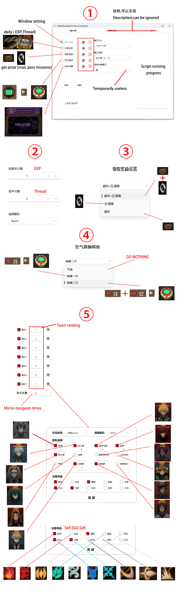 

在脚本执行过程可以使用 **CTRL+Q** 按键终止脚本进程（此操作可能导致脚本再次启动时出现问题，可以通过重启脚本程序解决）

没什么需要说明的，所见即所得

如果发现问题（除了下面那个队伍顺序编号问题），可以通过 [Issue](https://github.com/KIYI671/AhabAssistantLimbusCompany/issues) 反馈

当然也欢迎提交 [PR](https://github.com/KIYI671/AhabAssistantLimbusCompany/pulls)

### 主题包黑名单设置
Setting up a blacklist

release下载压缩包后，解压的文件中存在 **_“black_list_keyword.yaml”_** 这一文件
使用记事本或者其他文本编辑器打开后，可以仿照其格式自行添加黑名单

文件格式参考以下图片所示

The file format is shown in the following picture.

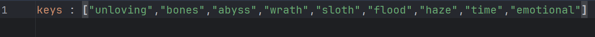

以下为脚本默认黑名单（Default blacklist）

 
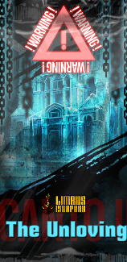 
 
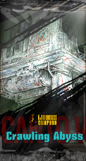 
 
 
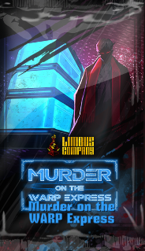 
 
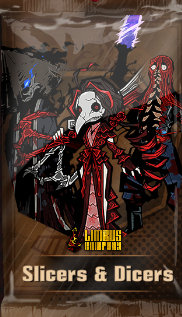 
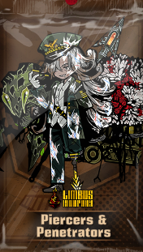 
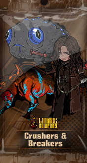 
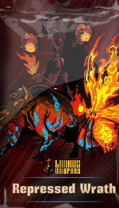 
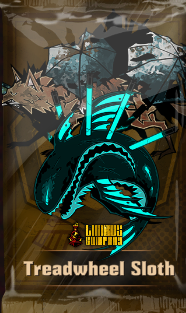 
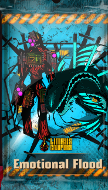 
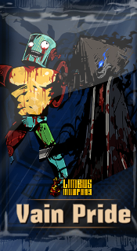 

### 后台运行
run in the background

- **需要后台运行或多显示器可以尝试 [远程本地多用户桌面](https://www.bilibili.com/read/cv24286313/)**
- **以上教程中所有相关文件：[下载链接](https://github.com/CHNZYX/asu_version_latest/releases)**
- **相关文件也可以前往教程作者 [主页-动态页](https://space.bilibili.com/26715033/dynamic) 从置顶中获取**
- 模拟器运行拥有卡顿，性能消耗大等诸多缺点
- 推荐您使用 Windows 自带的远程桌面服务进行该程序
- 在电脑上直接运行的性能消耗要小于模拟器

## 注意！！！
- **_此项目仅支持使用英语(EN)作为游戏语言进行使用_**
- 暂时只能使用1920 * 1080的窗口运行，未测试屏幕小于等于1920 * 1080的情况
- 可能存在各种奇奇怪怪的BUG

---

## 声明
Disclaimer

本软件开源、免费，仅供学习交流使用。

若您遇到商家使用本软件进行代练并收费，可能是设备与时间等费用，产生的问题及后果与本软件无关。

获取管理员权限是为了确保运行顺利

该版本离线，只能到github自助更新

软件图标素材来源网图，不属于GPL协议开源的内容，如有侵权，请及时联系作者删除

用户在使用过程中需自行遵守相关平台的使用规则与服务条款。因使用本软件可能导致的游戏账号封禁、违规行为等一切后果，作者概不负责。用户需对自身行为负责，并承担使用本软件可能带来的所有风险。

---

## 图示样例
Pic
（图片仅供参考，还请以实例为准）

### 开始界面

### 镜牢队伍设置界面

---
## 致谢
Thanks

### 单独致谢
AALC的项目离不开以下开源项目的帮助

| 项目      | 链接                                                                              | -                                         |
|---------|---------------------------------------------------------------------------------|-------------------------------------------|
| LALC    | [LixAssistantLimbusCompany](https://github.com/HSLix/LixAssistantLimbusCompany) | 感谢大佬的开源，让我能通过一步步跟进重写大佬的项目，从而学习、开始自己的项目    |
| OCR文字识别 | [PaddleOCR-json](https://github.com/hiroi-sora/PaddleOCR-json)                  | 没有它就没有自动识别队伍、自动识别镜牢主题包的功能                 |
| 图形界面组件库 | [PyQt-Fluent-Widgets](https://github.com/zhiyiYo/PyQt-Fluent-Widgets)           | 虽然只是用到了基础的部件，没怎么开发潜力，但是基础的部件已经让GUI的美观性UP了 |
| 三月七小助手  | [March7thAssistant](https://github.com/moesnow/March7thAssistant)         | 从大佬这里学到了挺多（~~下一个全项目拆解预备~~）                    |

### 统一致谢
直接或间接参与到本软件开发的所有人员

包括在网络上分享各种教程的大佬们

还有开源自己代码的巨佬们！

---
## 未来计划
- [ ] 修复已发现的BUG
- [ ] 休息室合成EGO饰品
- [ ] 重头开始学计算机的课程
- [ ] ……

---
## 如果想学习这个项目的代码
- 还是别学了吧，代码整一个稀烂
- 如果真要学，遇到使用pyinstaller打包程序失败，提示是Log问题时，参考[这个](https://github.com/ydf0509/nb_log/issues/61)

---
## 最后
Last

如果你觉得该软件对你有帮助，请点个Star吧。

希望有大佬对这个充满初学者风格的乱七八糟的代码进行一波指点或者优化

希望这个软件能帮助大家减少limbus游玩过程中反复乏味的部分，享受里面精彩的剧情、演出和机制
